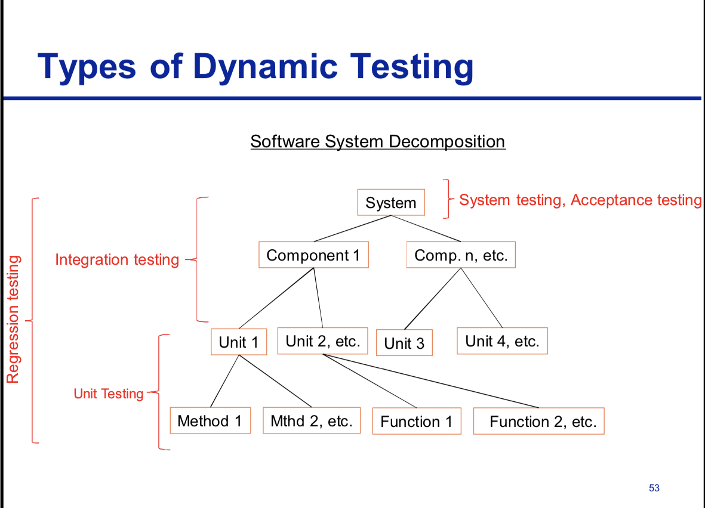
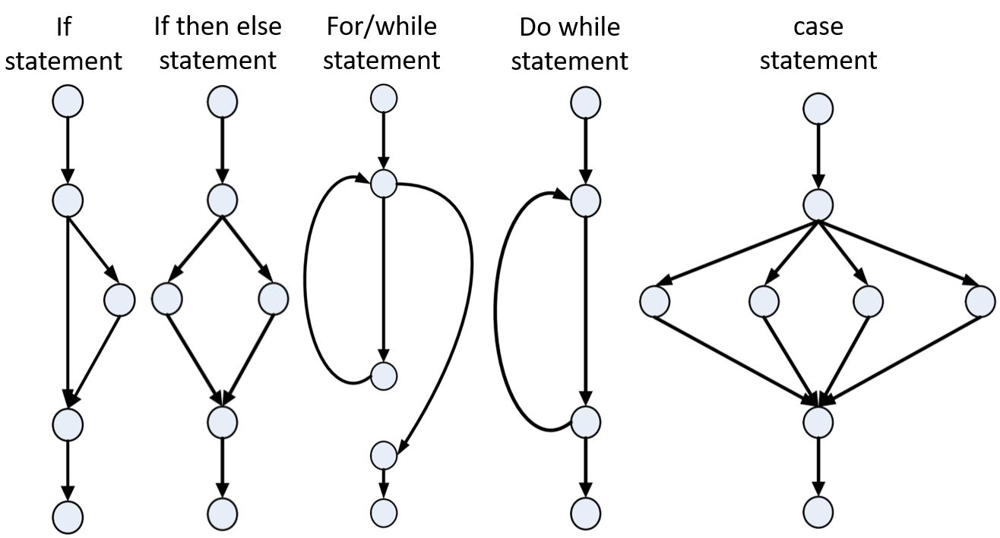

 <h3 align="center"> Testing </h3>

Q1. what is testing?
* Testing is a controlled exercise which involves an object under test, definition of the environment, definition of the inputs and definition of the expected outputs.
    * the systematic exploration of component system with the main aim finding and reporting defects.
    
Q2. Making use of a diagram, outline a typical software system decomposition, clearly indicating where different types of software testing are undertaken.

   

 <h3 align="center"> Exit Criteria </h3>

Q1. In the context of software testing, explain the meaning of exit criteria including a clear explanation of the need for establishing exit criteria.

Q2. In your own words, explain what is meant by the term "exit criteria" in the context of software testing, providing three distinct examples of exit criteria.

Q3. In your opinion, is it advisable to release software without having set and satisfied
specific test exit criteria? Discuss your opinion, presenting clear rationale and any
possible exceptional cases where your opinion might be changed.

* Trigger to say "we've done enough", knowing when to stop and when all objectives and outputs have been met. Important in test planning and test control
    * Evaluating exit criteria is the activity where test execution is assessed against the defined objectives
    * The purpose of exit criteria is to define when to stop testing, such as at the end of a test level or when a set of tests has a specific goal.
    * Thoroughness measures, such as coverage of code, functionality or risk
    * Estimates of defect density or reliability measures Cost
    * Residual risks, such as defects not fixed or lack of test coverage in certain areas
    * Schedules such as those based on time to market
 
 <h4 align="center"> Coverage </h4>
 
 Q1. Discuss the concept of coverage as relevant to software testing and describe four different types of coverage.
 
 * Coverage items are usually defined in terms of requirements, conditions, business transactions code statements, branches.
 * Amount of testing performed by a set of test cases is called Test Coverage
 * technique which determines whether our test cases are actually covering the application code and how much code is exercised when we run those test cases
    * statement coverage - every statement executed at least once.
        * Statement Coverage = (statements executed / total statements) * 100
    * Branch coverage - every outcome of every decision executed at least once
        * Branch Coverage = (branch outcomes executed / total branch outcomes) * 100
    * path coverage - concerned with testing all possible outcomes from all possible statements / decisions and in all possible combinations.
        * Path Coverage = (paths executed / total number of paths) * 100
    * Structural coverage - 100% coverage of transfers of control or data between components in scope
    * Functional coverage - 100% equivalence partitions for all message and function call parameters (valid and invalid values)
 
 <h3 align="center"> Paths </h3>
 
   

   
 <h3 align="center"> Test Design Techniques </h3>
 
 Q1. Using examples, clearly highlight the difference between black box and white box testing.
 
 Q2. In your opinion, might black box and white box testing have been given more explanatory names???? I dunno
 
 Q3. When conducting dynamic testing, both “black box” and “white box” techniques can be adopted. Briefly explain the difference between black box and white box techniques.
 
 * Specification based Black-Box 
   * Deriving test cases directly from a specification or model of a system/proposed system. Models, either formal or informal, are used for the specification of the problem to be solved, the software or its components. Test cases can then be derived systematically.
 * Structure based White-box
   * Deriving test cases directly from the code written (or design) to implement a system. Information about how the software is constructed is used to derive test cases. The extent of coverage of the software can be measured for existing test cases, and further test cases can be derived systematically to increase coverage.
   
 <h3 align="center"> Test Planning </h3>

Q1. In test planning, a contingency is sometimes incorporated. Explain what is meant by the term contingency and offer your opinion as to its necessity.

* Contingency accounts for potential under-estimation
   * no contingency is risk based testing.
   * You never have complete information, so estimation is imprecise and prone to error, so yes it is needed
   * Additional testing of a plan or projection to determine the extent to which it can absorb unexpected or unforeseen delays, disasters, or losses without failing.

 <h3 align="center"> Data Flow Analysis and Control Flow Graphs </h3>

Q1. In your own words, provide a description for data flow analysis and program control flow analysis, and discuss the commonalities and differences that exist in these two approaches.

* data flow analysis - Concerned with how data is used on the different paths through the code. there are 3 types.
   * Undefined (u) The data has no defined value. 
   * Defined (d) The data is assigned a value.
   * Referenced (r) The data is used.
* Program control flow. Each branch is shown as a separate path and loops are shown by arrows looping back to the loop condition node The control flowgraph is a graphical representation of a program’s control structure. 
