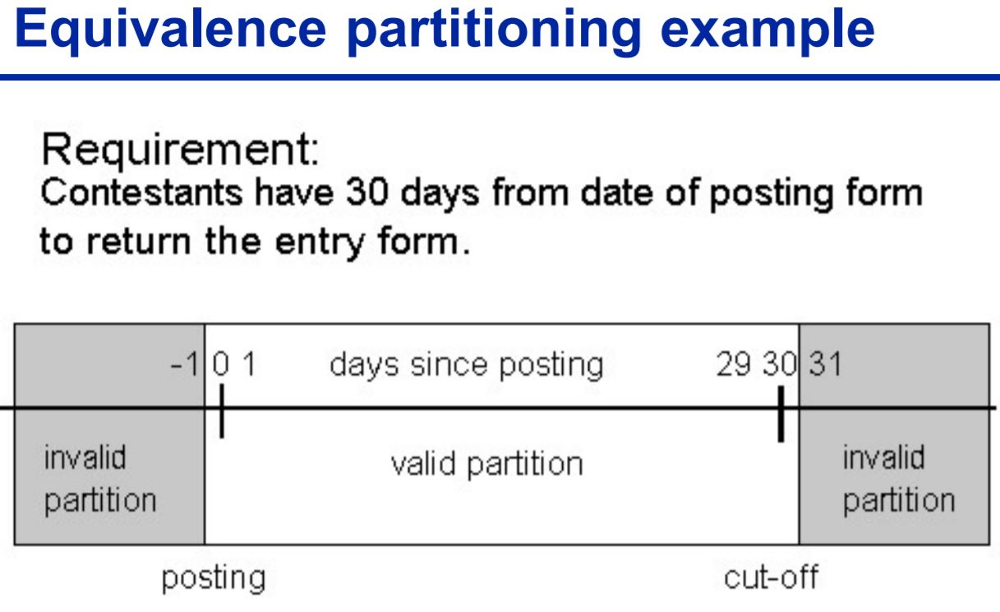

 <h3 align="center"> Testing </h3>
 
* Debugging and testing are different Testing can show failures that are caused by defects
* A failure is: a deviation of the software from its expected delivery or service (“problem”, “incident” or “issue”)
* A defect is: A manifestation of human error in software
* An error is: A human action producing an incorrect result When programmers make errors they introduce faults to program code

Q1. what is testing?
* Testing is a controlled exercise which involves an object under test, definition of the environment, definition of the inputs and definition of the expected outputs.
    * the systematic exploration of component system with the main aim finding and reporting defects.
* Static Testing
    * Testing without executing the program - “potential” faults, that is, problems that could lead to faults when the program is modified
* Dynamic Testing
    * Testing by executing the program with real inputs - Includes various techniques but requires the coding stage to be completed.
    
Q2. Making use of a diagram, outline a typical software system decomposition, clearly indicating where different types of software testing are undertaken.

   

 <h3 align="center"> Exit Criteria </h3>

Q1. In the context of software testing, explain the meaning of exit criteria including a clear explanation of the need for establishing exit criteria.

Q2. In your own words, explain what is meant by the term "exit criteria" in the context of software testing, providing three distinct examples of exit criteria.

Q3. In your opinion, is it advisable to release software without having set and satisfied
specific test exit criteria? Discuss your opinion, presenting clear rationale and any
possible exceptional cases where your opinion might be changed.

* Trigger to say "we've done enough", knowing when to stop and when all objectives and outputs have been met. Important in test planning and test control
    * Evaluating exit criteria is the activity where test execution is assessed against the defined objectives
    * The purpose of exit criteria is to define when to stop testing, such as at the end of a test level or when a set of tests has a specific goal.
    * Thoroughness measures, such as coverage of code, functionality or risk
    * Estimates of defect density or reliability measures Cost
    * Residual risks, such as defects not fixed or lack of test coverage in certain areas
    * Schedules such as those based on time to market
 
 <h3 align="center"> Coverage </h3>
 
 Q1. Discuss the concept of coverage as relevant to software testing and describe four different types of coverage.
 
 * Coverage items are usually defined in terms of requirements, conditions, business transactions code statements, branches.
 * Amount of testing performed by a set of test cases is called Test Coverage
 * technique which determines whether our test cases are actually covering the application code and how much code is exercised when we run those test cases
    * statement coverage - every statement executed at least once.
        * Statement Coverage = (statements executed / total statements) * 100
    * Branch coverage - every outcome of every decision executed at least once
        * Branch Coverage = (branch outcomes executed / total branch outcomes) * 100
    * path coverage - concerned with testing all possible outcomes from all possible statements / decisions and in all possible combinations.
        * Path Coverage = (paths executed / total number of paths) * 100
    * Structural coverage - 100% coverage of transfers of control or data between components in scope
    * Functional coverage - 100% equivalence partitions for all message and function call parameters (valid and invalid values)
 
 <h3 align="center"> Paths </h3>
 
   

   
 <h3 align="center"> Software Development Models </h3>

* RIP
   
 <h3 align="center"> Test Design Techniques </h3>
 
 * Purpose of test design techniques is to identify test conditions and test cases.
 
 Q1. Using examples, clearly highlight the difference between black box and white box testing?
 
 Q2. In your opinion, might black box and white box testing have been given more explanatory names???? I dunno, yes
 
 Q3. When conducting dynamic testing, both “black box” and “white box” techniques can be adopted. Briefly explain the difference between black box and white box techniques.
 
 * Specification based Black-Box (Behavioral Testing)
   * Deriving test cases directly from a specification or model of a system/proposed system. Models, either formal or informal, are used for the specification of the problem to be solved, the software or its components. Test cases can then be derived systematically.
   * internal structure/design/implementation of the item being tested is not known to the tester
 * Structure based White-box (Clear Box Testing, Open Box Testing, Glass Box Testing, Transparent Box Testing, Code-Based Testing or Structural Testing)
   * internal structure/design/implementation of the item being tested is known to the tester
   * Deriving test cases directly from the code written (or design) to implement a system. Information about how the software is constructed is used to derive test cases. The extent of coverage of the software can be measured for existing test cases, and further test cases can be derived systematically to increase coverage.
   
Q4. in your own words, describe the practice of equivalence class partitioning, making use of an example as appropriate.

 *
Q5. In your opinion, should both boundary value analysis and equivalence class partitioning be adopted when designing test data and test cases? Justify your response with clear reasoning
   
* Equivalence partitioning (considered representative of the complete partition)
   * is based on dividing a set of test conditions into groups that can be considered the same, that is, the system will treat them equivalently.
   * Equivalence partitioning is the process of methodically reducing the large (or perhaps infinite) set of possible test cases into a small, but equally effective, set of test cases.

 
 
 

   
Q6. Employing the use of an example, outline the meaning of boundary value analysis in the context of software testing.

Q7. In your opinion, is a technique such as boundary value analysis critical to everyday software testing? Clearly justify your opinion with two distinct reasons.

* Experience shows more faults at boundaries of equivalence partitions where partitions are continuous.
   * So test cases just above, just below and on the boundary tend to find faults Don't forget test cases for output partitions: just above, on, just below boundaries
   * 1)identify the boundary value 2)select test values: just above and below 3)three values per boundary
* why its important.
   * BV subsumes EP where the partitions are ranges of values
   * If you have covered all boundary values you automatically get EP coverage
   * You might have chosen different EP values, but since all values in a partition ARE equivalent any test value – even extreme ones - will do it.

 <h3 align="center"> Test Planning </h3>

Q1. In test planning, a contingency is sometimes incorporated. Explain what is meant by the term contingency and offer your opinion as to its necessity.

* Contingency accounts for potential under-estimation
   * no contingency is risk based testing.
   * You never have complete information, so estimation is imprecise and prone to error, so yes it is needed
   * Additional testing of a plan or projection to determine the extent to which it can absorb unexpected or unforeseen delays, disasters, or losses without failing.

 <h3 align="center"> Data Flow Analysis and Control Flow Graphs </h3>

Q1. In your own words, provide a description for data flow analysis and program control flow analysis, and discuss the commonalities and differences that exist in these two approaches.

* Data Flow Analysis - Concerned with how data is used on the different paths through the code. there are 3 types.
   * Undefined (u) The data has no defined value. 
   * Defined (d) The data is assigned a value.
   * Referenced (r) The data is used.
* Program control flow. Each branch is shown as a separate path and loops are shown by arrows looping back to the loop condition node The control flowgraph is a graphical representation of a program’s control structure.
   * control flow or flow of control is the order function calls, instructions, and statements are executed or evaluated when a program is running.
   * static-code-analysis technique for determining the control flow of a program

 <h3 align="center"> Unit Testing </h3>
 
* Debugging is the programmer activity that identifies the cause of a defect, repairs the code and checks that the defect has been fixed correctly
* debugging is not testing, it is a tool used by developers to investigate suspected defects. Debuggers are tools used by developers to investigate this particular type of defect.
* The debugger is a program that enables developers to step through their code one line at a time in the same order that they are executed.

Q1. Clearly outline the role of a debugger, describing 6 distinct features that are supported in the IDLE debugger.
* Go - Executes the rest of the code as normal, or until it reaches a break point (we discuss break points later.)
* Step - Step one instruction. If the line contains a function call, the debugger will step into the function.
* Over - Step one instruction. If the line is a function call, the debugger won’t step into the function, but instead step over the call.
* Out - Keeps stepping over lines of code until the debugger leaves the function it was in when Out was clicked. This steps out of the function.
* Quit - Immediately terminates the program.
* breakpoint - prevents stepping through unecessary code. if we know which area the problem is ocurring, we can ignore all problems leading up to the problem area through the use of breakpoints.

Q2. In your opinion, should unit testing be implemented by all industry-based programmers and for all code? Justify your response with clear reasoning.

* Unit Testing: addresses the quality of individual units (e.g. methods, functions)
   * Unit tests help developers to verify that the logic / behaviour of a piece of code/software is correct. 
   * Re-performing unit tests (automatically) can identify software regressions introduced by changes in the code. 
   * Unit tests are therefore very useful for regression testing
   * Unit testing frameworks can be harnessed for integration and system level testing also. - May not be sensible to write unit tests for all code.

Q3. In your own words, describe PyUnit including an explanation of why it is important for software testing.

* PyUnit is a unit testing framework for Python
* PyUnit is a Python language version of JUnit 
* Plays a crucial role in test-driven development •
* Advocates the idea of "first testing then coding“ which is aligned with a test driven development (TDD) philosophy
	  * Set up the test data for a piece of code
	  * Test the test set up
	  * Then write the code
	  * Then unit test the code using the test set up
* Unit testing can increase programme productivity
   * If implemented correctly, less time will be required for debugging / resolving defects

Q4. Explain the role of assertions in PyUnit, providing examples of two types of PyUnit assertions.

* helps with debgging by testing a condition. If the condition is true, it does nothing and your program just continues to execute.
* But if the assert condition evaluates to false, it raises an AssertionError exception with an optional error message.
   * assertEqual(a, b) a == b, assertNotEqual(a, b) a != b, assertTrue(x) bool(x) is True, assertFalse(x) bool(x) is False, assertAlmostEqual(a, b, c), assertNotAlmostEqual(a, b) 

 <h3 align="center"> Defect Severity & Priority </h3>
 
 Q1. Provide a description for defect severity and defect priority, and in your opinion, which of these two concerns is most important in the context of software testing? Justify your response with clear rationale and examples as appropriate.
 
 

 
 
 

 

Q2. In your opinion, is the use of an integrated development environment (IDE) beneficial for software testing? Justify your opinion with three clear reasons.

* improved developer productivity
* Increased Efficiency
* Collaboration – A group of programmers can easily work together within an IDE.
* minimize coding mistakes and typos

